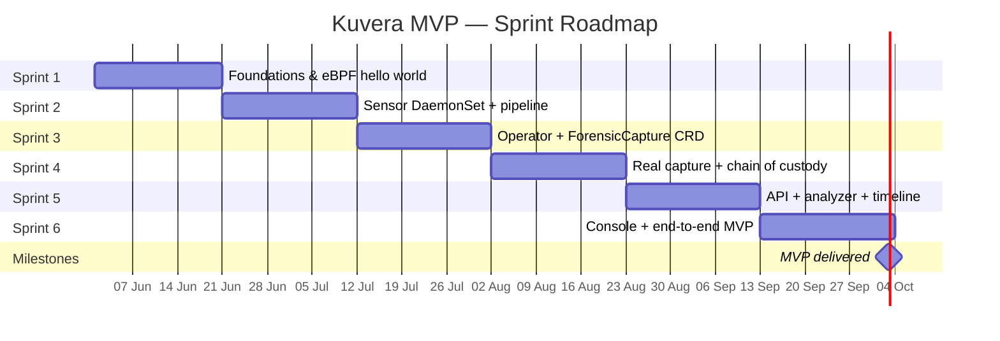

# Kuvera Roadmap

This document is the durable, version-controlled view of the Kuvera MVP roadmap.
For live ticket state, see the [Kuvera GitHub Project](https://github.com/users/<owner>/projects/<n>).

**MVP target:** 03 October 2026  
**Sprint length:** 3 weeks  
**Approach:** Vertical slice first, then deepen. Each sprint ends in a demoable state.

## Sprint schedule

| Sprint | Dates                     | Theme                                |
|--------|---------------------------|--------------------------------------|
| 1      | 01 Jun – 20 Jun 2026       | Foundations & eBPF hello world       |
| 2      | 21 Jun – 11 Jul 2026       | Sensor as DaemonSet + event pipeline |
| 3      | 12 Jun – 01 Aug 2026       | Operator skeleton + ForensicCapture  |
| 4      | 02 Aug – 22 Aug 2026       | Real capture + chain of custody      |
| 5      | 23 Aug – 12 Sep 2026       | API gateway + analyzer + timeline    |
| 6      | 13 Sep – 03 Oct 2026       | Console + end-to-end MVP             |

## Sprint goals & acceptance criteria

### Sprint 1 — Foundations & eBPF hello world (25 May – 7 Jun)
**Goal:** Repo, tooling, CI, and a single eBPF program capturing `execve` events for one container, printed to stdout from userspace.

**Acceptance criteria:**
- Monorepo scaffolded.
- `make dev-cluster`, `make build`, `make lint`, `make test` all work.
- CI runs lint + test on every PR.
- A standalone Go binary loads an eBPF program that captures `execve` and prints events filtered by cgroup ID.
- Runs on the kind cluster from `make dev-cluster`.

### Sprint 2 — Sensor as DaemonSet + event pipeline (8 Jun – 21 Jun)
**Goal:** The sensor runs as a real DaemonSet on every node, captures `execve`/`openat`/`connect`/`clone`, scopes events per container via cgroup ID, and writes to a local ring buffer with a userspace shipper.

**Acceptance criteria:**
- DaemonSet manifest in `deploy/manifests/`.
- Sensor runs on every node in the dev cluster.
- Four syscalls captured with per-container scoping.
- Events written to a local ring buffer; userspace agent reads and persists last hour to disk.
- No network egress from the sensor.
- Sensor CPU overhead measured and documented (<2% target).

### Sprint 3 — Operator skeleton + ForensicCapture CRD (22 Jun – 5 Jul)
**Goal:** Kubebuilder operator with the `ForensicCapture` and `EvidenceBundle` CRDs. Reconciler logs intent but does not yet capture.

**Acceptance criteria:**
- Operator scaffolded with Kubebuilder.
- Both CRDs defined, validated via OpenAPI schema.
- Reconciler transitions `ForensicCapture` through phases (`Pending` → `Capturing` → `Sealed`) with stubbed actions.
- RBAC: operator can read pods cluster-wide, write its own CRDs, nothing else.
- Helm chart deploys operator + CRDs.

### Sprint 4 — Real capture + chain of custody (6 Jul – 19 Jul)
**Goal:** Operator performs real evidence capture: pause container via CRI, tar the filesystem, pull pod manifest, dump sensor history, hash everything, build a bundle, upload to SeaweedFS, append to transparency log.

**Acceptance criteria:**
- Container pause via CRI works.
- Filesystem export to tar, SHA-256 hashed.
- Sensor history for target pod exported (last 60 min).
- Pod manifest + K8s events scraped.
- Bundle assembled with Merkle root; root signed by operator key.
- Transparency log appended (local append-only file, Rekor-inspired).
- Bundle uploaded to SeaweedFS, content-addressed by SHA-256.
- All chain-of-custody touched tickets flagged for review.

### Sprint 5 — API gateway + analyzer + timeline (20 Jul – 2 Aug)
**Goal:** gRPC + REST API gateway. Python analyzer ingests a bundle and produces a normalized JSON timeline. Metadata persisted to Postgres.

**Acceptance criteria:**
- API gateway: `ListCaptures`, `GetCapture`, `GetBundle`, `DownloadArtifact` endpoints.
- Proto definitions in `api/proto/`, generated clients committed.
- Python analyzer worker consumes bundles, emits timeline JSON.
- Postgres schema with TimescaleDB extension for timeline events.
- Bundle metadata and timeline events queryable via API.

### Sprint 6 — Console + end-to-end MVP (3 Aug – 16 Aug)
**Goal:** Web UI to list captures, view capture detail, render timeline as a table, download bundle. End-to-end demo: trigger capture → wait → investigate in UI.

**Acceptance criteria:**
- React + Vite console scaffolded.
- Generated TypeScript API client from proto via `buf generate`.
- Views: capture list, capture detail with metadata, timeline table.
- Bundle download from UI.
- End-to-end: `kubectl apply` a `ForensicCapture`, see it in the console, download the sealed bundle, view its timeline.
- `make e2e` runs the full flow against the dev cluster.

## Gantt

## Post-MVP (not scheduled)

- Memory dumping (CRIU)
- Volatility3 integration
- Cloud volume snapshots (AWS EBS / GCP PD / Azure Managed Disk)
- OpenSearch
- Multi-cluster federation
- SSO/SAML, RBAC, compliance reports
- Detection-tool webhooks (Falco, Tetragon)
